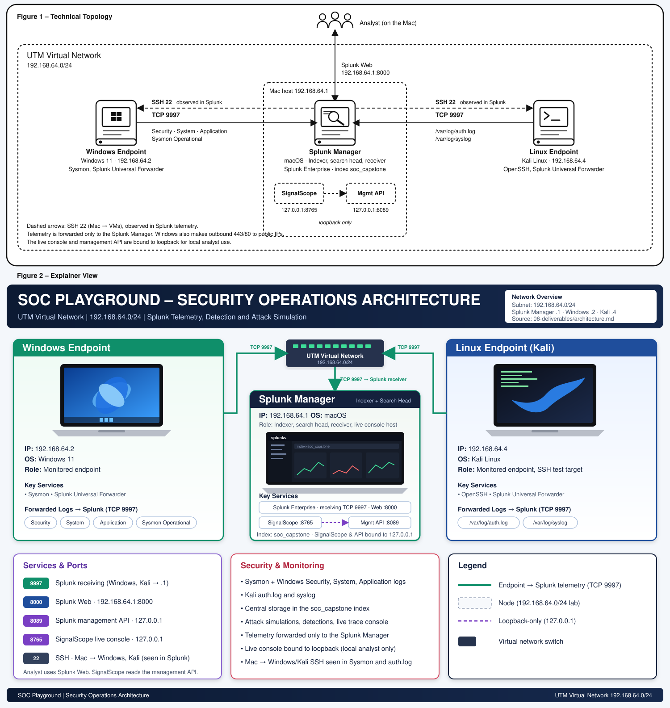

# Architecture Topology

## Node Summary

| Node | IP | Role | Services |
|------|-----|------|----------|
| macOS host | 192.168.64.1 | Splunk manager (indexer, search head, receiver) | Splunk Enterprise, SignalScope console |
| Windows 11 VM | 192.168.64.2 | Monitored endpoint | Sysmon, Splunk Universal Forwarder |
| Kali Linux VM | 192.168.64.4 | Monitored endpoint + attack target | OpenSSH, Splunk Universal Forwarder |

## Data Flows
- Windows → Mac : TCP 9997 — Security, System, Application, Sysmon logs
- Kali → Mac : TCP 9997 — /var/log/auth.log, /var/log/syslog
- Analyst → Mac : HTTP 8000 — Splunk Web UI
- Analyst → Mac : HTTP 8765 — SignalScope live console (loopback)
- Splunk mgmt API : 8089 (loopback only)
- Mac → Kali : TCP 22 — SSH brute force (Attk101), observed in linux_secure logs
- Mac → Windows : TCP 22 — SSH administration, observed in Sysmon EID 3
- Kali → Windows : TCP 22, 445 — SSH and SMB attempts, observed in Sysmon EID 3 and Security 4625
- Windows → Mac : HTTP 8000 — PowerShell DownloadString payload fetch (Attk103), observed in Sysmon EID 1

> Note: The topology is not fully isolated. Windows VMs make outbound connections to public IPs (observed in Sysmon EID 3 to ports 443/80). The lab telemetry (auth.log, Security, Sysmon) is forwarded only to the Splunk Manager via TCP 9997.