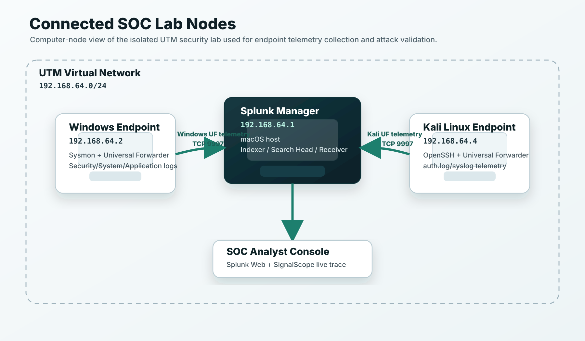
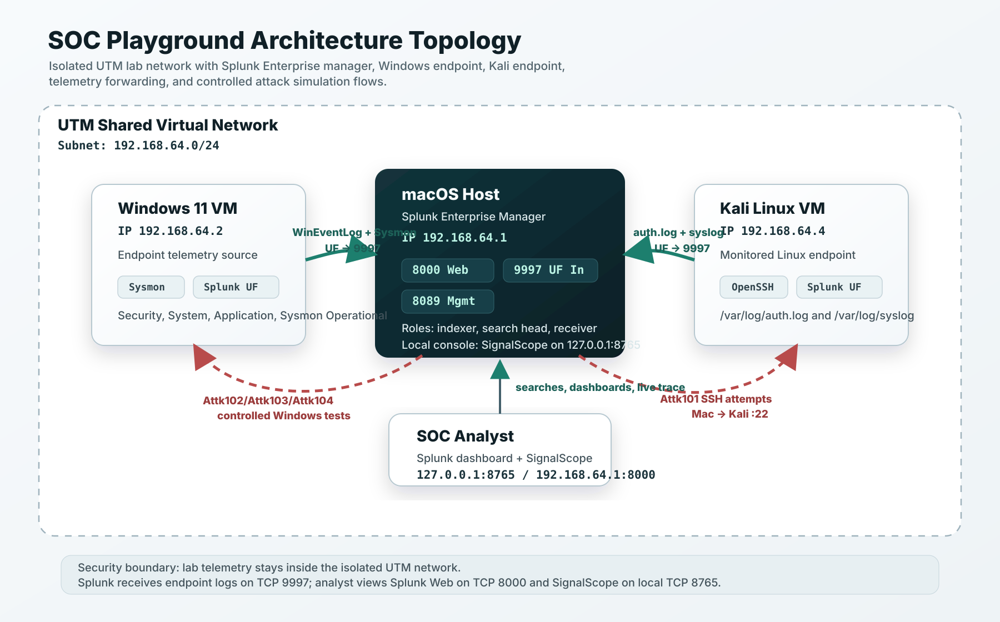

# Architecture Topology

## Figure 1 - Connected Lab Nodes

## Figure 2 - Detailed Telemetry and Attack Flow

## Node Inventory

| Node | IP address | Operating system | Role | Key services |
|------|------------|------------------|------|--------------|
| Splunk Manager | `192.168.64.1` | macOS | Indexer, search head, receiver, live console host | Splunk Enterprise, SignalScope |
| Windows Endpoint | `192.168.64.2` | Windows 11 | Monitored endpoint | Sysmon, Splunk Universal Forwarder |
| Linux Endpoint | `192.168.64.4` | Kali Linux | Monitored endpoint and SSH test target | OpenSSH, Splunk Universal Forwarder |

## Telemetry Flow

Windows forwards Security, System, Application, and Sysmon Operational logs to
the Splunk Manager over TCP `9997`. Kali forwards `/var/log/auth.log` and
`/var/log/syslog` to the same receiver. Splunk stores the data in the
`soc_capstone` index.

## Analyst Access

The analyst uses Splunk Web on `192.168.64.1:8000` for searches and dashboards.
SignalScope runs locally on the Mac at `127.0.0.1:8765` and reads from Splunk's
management API on `127.0.0.1:8089`.

## Security Boundary

The lab is contained inside the UTM virtual network `192.168.64.0/24`. Endpoint
telemetry stays inside the lab network and is forwarded only to the Splunk
Manager. The live console is bound to loopback for local analyst use.
