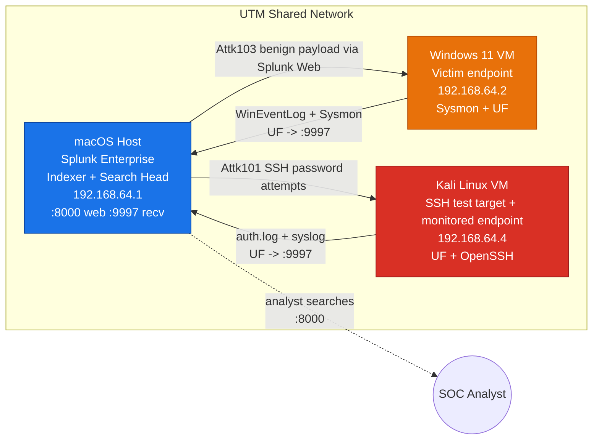

# Architecture / Network Diagram

Use the ready-to-submit SVG diagram below in the report:

If your current VM IP addresses differ, update the SVG text before submitting.
The lab values used here are:

| Node | IP | Role |
|------|----|------|
| macOS host | `192.168.64.1` | Splunk Enterprise manager, receiver, live console |
| Windows 11 VM | `192.168.64.2` | Monitored endpoint |
| Kali VM | `192.168.64.4` | Monitored Linux endpoint and SSH test target |

## Editable Mermaid version

Copy this into draw.io, Mermaid Live, or a draw.io Mermaid shape if you need a
quick editable version.

## Mermaid (paste into https://mermaid.live or a draw.io Mermaid shape)

## Node / data-flow description (for the write-up)

| Node | IP | OS | Role | Software | Listening ports |
|------|----|----|------|----------|-----------------|
| macOS host | 192.168.64.1 | macOS | SIEM manager (indexer + search head + receiver) | Splunk Enterprise | 8000 (web), 8089 (mgmt), 9997 (receive), 8765 (local console) |
| Windows 11 VM | 192.168.64.2 | Win 11 | Victim endpoint | Sysmon, Splunk UF | outbound forwarding |
| Kali VM | 192.168.64.4 | Kali | SSH test target + monitored Linux endpoint | Splunk UF, OpenSSH | 22 (SSH target) |

**Data flows (arrows):**
1. Windows UF → `192.168.64.1:9997` — WinEventLog (Security/System/Application) + Sysmon Operational → index `soc_capstone`.
2. Kali UF → `192.168.64.1:9997` — `/var/log/auth.log` + `/var/log/syslog` → index `soc_capstone`.
3. Mac → Kali : SSH password attempts (Attk101); Mac → Windows Splunk Web: benign PowerShell payload (Attk103).
4. SOC analyst → `http://192.168.64.1:8000` — Splunk searches + dashboard; `http://127.0.0.1:8765` — live trace console.

**Security boundary:** all traffic stays on the clone owner's isolated UTM
virtual network; no exposure to the host's physical LAN/WAN except Splunk
download/update traffic from the Mac.
